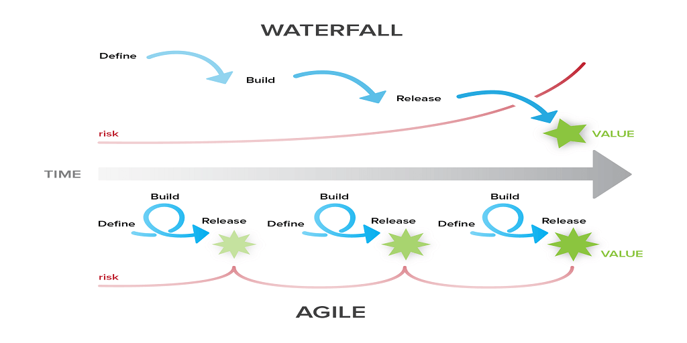

# 3. Agile Development

[&lt;&lt; Workflows](../workflows/README.md) \| [Top](../README.md) \| [UX/UI Design &gt;&gt;](../ux-ui-design/README.md)

<!--  -->

---

[examples, exercises and guides](https://github.com/HackYourFutureBelgium/agile-development)

---

_Agile Development_ is a methodology for developing software. In this methodology you start with the simplest code you can possibly write to get things started. This can even be just empty files with the right names in the right folders! Then in small steps you add more code so that each little step _works_, is meaningful for the user, and is a little closer to the end goal.

This strategy is sooooo important to learn because **programming is hard**. All developers \(even your coaches!\) make mistakes all the time. The best way to manage mistakes is to work in small, understandable steps and making sure that each step works before moving on.

Agile development is more about discipline than talent. Every minute you spend practicing this now will save you hours of debugging and make collaboration a breeze!

## Learning Objectives

- **Collaborating**: You can effectively work in a group:
  - 🥚 You can work with your group mates to agree on a communication plan.
  - 🥚 As a group you can define project constraints by discussing your strength's, weaknesses and context.
  - 🥚 During development you can ask your group for help when you need it using the agreed channels of communication.
  - 🥚 During development you communicate any changes in your personal situation that will impact the group.
  - 🥚 When the project is finished your group can write a retrospective including concrete steps to make sure the next project goes smoother.
- **Planning**: You can work in a group to plan a multi-page website written with HTML & CSS:
  - 🥚 You can understand a web page's users by creating user personas.
  - 🥚 You can work together to write a backlog of user stories for your personas, organized by priority (_must_, _should_, _could_)
  - 🥚 You can work together to create a simple wireframe with pencil+paper and a basic drawing app like Excalidraw
  - 🐣 You can work together to write a development strategy for _must-have_ user stories.
  - 🐣 You can work together to convert a development strategy into issues on a project board organized with labels and milestones.
- **Developing**: Once the project board is set up you can work with your group to develop the website:
  - 🥚 You can claim a task and manage your progress using the project board columns.
  - 🥚 Your group can use issues to discuss and agree on project changes once development has begun.
  - 🥚 You can use the `help-wanted` label to ask for help, and to find issues that need your help.
  - 🥚 You can manage a separate branch with your work for each issue task.
  - 🥚 You can create a PR that passes CI checks when your task is finished, then assign someone to review it.
  - 🐣 You can review a group member's PR and conduct a code review using the project's checklist.
