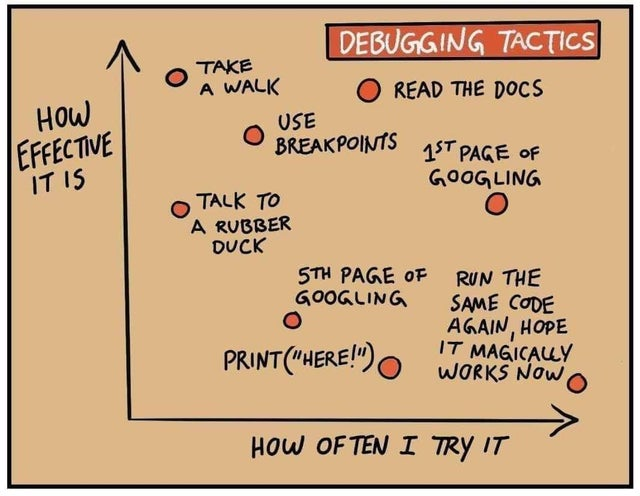

# 6. Debugging

[&lt;&lt; Welcome to JS](welcome-to-js/) \| [Top](debugging.md) \| [Behavior, Strategy, Implementation &gt;&gt;](behavior-strategy-implementation/)

> If debugging is the process of removing software bugs, then programming must be the process of putting them in.
>
> * [Donald Knuth](https://en.wikipedia.org/wiki/Donald_Knuth)

[examples, exercises and guides](https://github.com/HackYourFutureBelgium/debugging)

## Learning Objectives

> objectives are limited to programs under 40 lines written in the subset of JS covered in Debugging

* 🥚 **Stepping Through**: You can use the browser's debugger to step through your code, making a prediction and checking your guess at each step. They can use breakpoints and the `debugger` statement to pause the program on specific lines.
* 🥚 **Assertion Testing**: You is familiar with assertions and can use pre-written assertions them to guide your study of a program.
* 🥚 **Logging**: You is capable of tracing specific aspects of a program's execution using `console.log`.
* 🥚 **Program Life Cycle**: You can explain the two phases of a program's life cycle.
* 🥚 **Fixing Errors**: You can use the structured comment to describe an error in your program, and can make several educated guesses at how to fix the error.
* 🥚 **Naming Variables**: You can analyze a program's variables according to the structured comment, and rename the variables. Your variable names will describe the variable's role in the program and contextualize the variable in the program's domain. This includes deciding whether to use `let` or `const`.
* 🥚 **Linting**: You can find and fix linting errors in JavaScript programs.
* 🐣 **Explicit Coercion**: You is aware of the rules for casting explicitly between types and can complete assertions to describe what value will result, they can have access to the internet and a console.
* 🐣 **Fixing Bugs**: You can use the structured comment to describe and fix a bug in small programs.
* 🐣 **Documenting Functions**: You can demonstrate your understanding of arguments, parameters and return values by writing a JSDoc comment.
* 🐥 **Debugging Functions**: You can read argument/return-value assertion tests to understand a function's actual vs. expected behavior, and to correct the function's behavior.
* 🐣 **Reference vs. Value**: You can explain how to swap references or values between variables, explain deep vs. strict equality, and compare two objects or arrays.
* 🐣 **Side-Effects**: Given a function that takes an array as an argument you can determine if the function has any side-effects, and can suggest a way to avoid the side-effect.
* 🐥 **Implicit Coercion**: You is aware that operators will implicitly cast it's operands to the same type before operating. They can look or experimentally discover the rules for an operator.
* 🐥 **Operator Precedence**: You can refactor an expression with several operators into several statements assigning each step of the expression to a new variable according to the languages rules of operator precedence.
* 🐥 **Sub-Goal Authoring**: Given most of a small program with missing goal, you can write code to implement the missing behavior.
* 🐔 **Refactoring Functions**: You can refactor a designated chunk of a program into an empty function body and pass the given assertion tests.
* 🐔 **Program Authoring**: you can write a small program to match specs \(user stories + test cases\), given basic starter code with labeled goals

