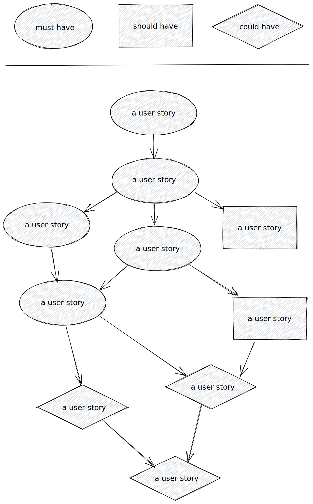

# Backlog (_First Draft_)

Now that your team shared a big-picture understanding of what you will build, it's time to get specific! In the _Backlog_ step of your project you will translate your big idea into specific **User Stories**, then organize all your user stories into a clear plan.

A Backlog is always a rough draft! Your team may need to adjust the Backlog during Development as the project changes and evolves. Just be sure to check with your teammates before changing the document, an easy way to do this is to create a PR and request a review.

## Setting Priorities

A Backlog is just a collection of User Stories that your team has agreed on. The finished backlog isn't very complicated, it's a list of User Stories sorted by priority. But coming up with the backlog isn't so easy. You'll need to think about all the things you could build and decide how important each one is:

- **Must Have**: these user stories are necessary for basic usability.
- **Should Have**: these user stories will complete the user experience, but are not necessary.
- **Could Have**: these user stories would be really cool ... if there's time

Deciding how to prioritize each user story will take lots of practice, trial and error. In this module it will be simpler since the projects are small and you'll often have code to start with. Starting in _UX/UI Design_ you will be assigned more open-ended projects. It will be your responsibility to **_scope_** your projects so they can be finished in one week.

---

## Story Sequencing

The user stories in your Backlog are sorted by priority, but not written in any particular order. Some user stories depend on each other, some do not. Figuring out these relationships will make it easy to go from a unsorted backlog to a structured development strategy.

Understanding these dependencies will also allow you to collaborate much more efficiently. Two people can develop different user stories at the same time if they do not depend on each other. And team mates can move on to new user stories that do not depend on yours without waiting for you to finish.

This question is all you need to get start sequencing your user stories:

- Does it make sense for a user to do _B_ without being able to do _A_?

A Story Sequencing Graph might look like this:

[](https://excalidraw.com/#json=5492536709742592,eehelCbxb4yj2n5D3cTn1g)

---

## Template File

Here's a template you can copy-paste into `/planning/backlog.md`:

```markdown
# Backlog

A collection of user stories for your project. Stories inside of each priority level are not necessarily in order. You and your team will decide when to develop each story by drawing out your [Story Sequencing](#story-sequencing).

## Must-Haves

are necessary for basic usability:

- **user story name**: As a [type of user] I want to [do something] so that [I achieve some goal]
  - Given [context] when [a specific action is performed] then [a set of consequences should occur]
  - ...
- **user story name**: As a [type of user] I want to [do something] so that [I achieve some goal]
  - Given [context] when [a specific action is performed] then [a set of consequences should occur]
  - ...
- ...

## Should-Haves

will complete the user experience, but are not necessary:

- **user story name**: As a [type of user] I want to [do something] so that [I achieve some goal]
  - Given [context] when [a specific action is performed] then [a set of consequences should occur]
  - ...
- **user story name**: As a [type of user] I want to [do something] so that [I achieve some goal]
  - Given [context] when [a specific action is performed] then [a set of consequences should occur]
  - ...
- ...

## Could-Haves

would be really cool ... if there's time:

- **user story name**: As a [type of user] I want to [do something] so that [I achieve some goal]
  - Given [context] when [a specific action is performed] then [a set of consequences should occur]
  - ...
- **user story name**: As a [type of user] I want to [do something] so that [I achieve some goal]
  - Given [context] when [a specific action is performed] then [a set of consequences should occur]
  - ...
- ...

---

## Story Sequencing


```
