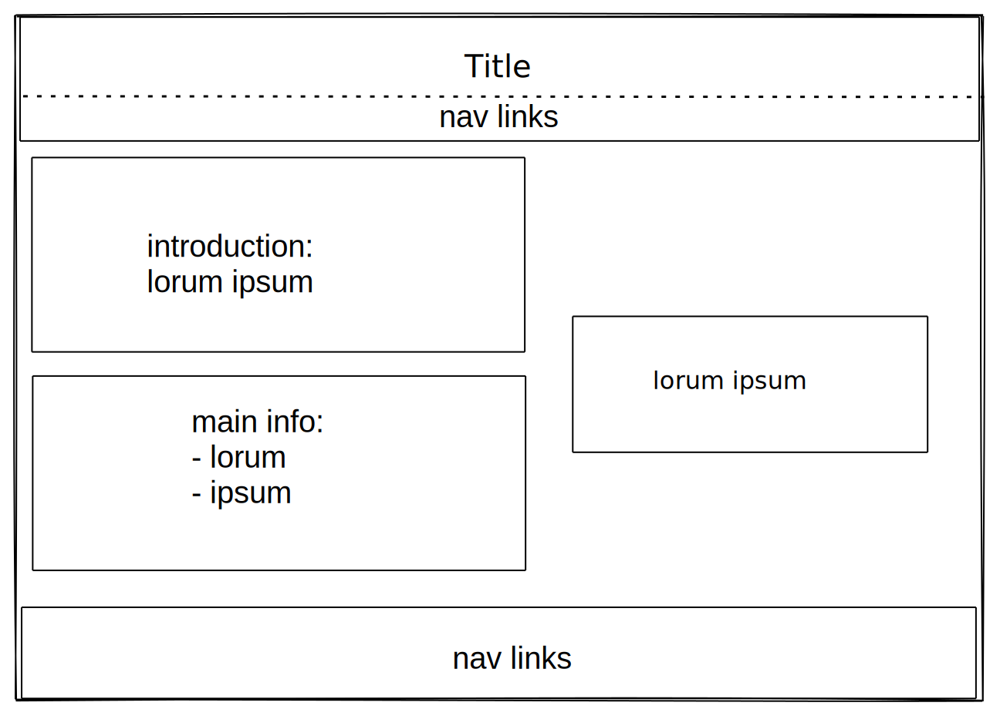

# 8. Design

Creating a full design for a website takes a lot of experience and specialized knowledge. You'll get an introduction to this in the UX/UI Design module, if you're interested in design can continue practicing by creating the designs for your group projects. If you're not so interested in design you should still learn how to draw a wireframe.

## Wireframes

A wireframe is a simplified drawing of what your website will look like. Wireframes don't have any real text, images, or design. The idea is just to lay out the basic skeleton of your site and to make sure that your group agrees on what to build.

Use your Backlog as a guide when designing your wireframe. Make sure that your **must-have** user stories are in the wireframe. You can also include your **should haves** into the wireframe, but **could-have**s aren't necessary. Take a look at [this wireframe](https://github.com/OksanaShulha/HYF.be-5/blob/main/planning/hyf-wireframe.png) from Class 13-14 for inspiration. Imagine how helpful it would be to have one of these for your group project!

Pencil and Paper are a great way to get started with your project's wireframes! When you want to go digital here's two websites you can try to create simple wireframes: [Excalidraw](https://excalidraw.com/), [wireframe.cc](http://wireframe.cc/). If you want to get fancy with your wireframes or have a more collaborative design then [Figma](https://figma.com) is a good option.

A wireframe can be as simple as this:

[](https://excalidraw.com/#json=5697932045058048,50g_dMeek8cnpk9dH1teGg)

## Template File

```text
# Design

<!-- give an overview of your project's design -->

<!-- provide a link to your wireframe documenting on Figma, or wherever it is -->

[link to wireframe]()

---

<!-- describe some of the reasoning behind your group's design and wireframe -->
```

